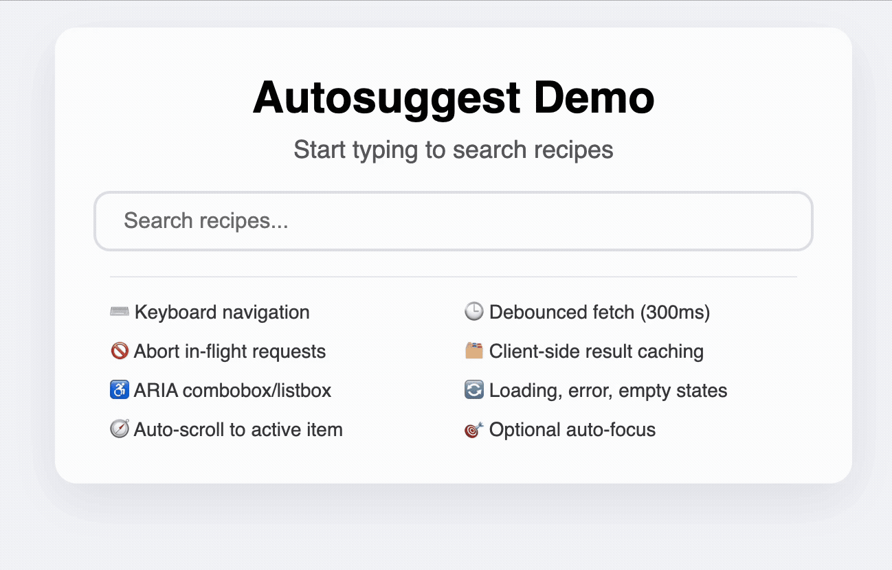

# 🧩 Autosuggest Component - React

A comprehensive, reusable React component for auto-suggestion input fields, designed with interview best practices and real-world usability in mind.

GitHub Repository: https://github.com/sudo-sanjeev/auto-suggest

📖 **Detailed Article**: [React Machine Coding Interview Guide: Autosuggest Component](https://medium.com/@sanjeev-singh/react-machine-coding-interview-guide-autosuggest-component-91b8b20494c8)

## ✅ Milestones

| Milestone | Description                                                                                                                                                                                    |
| --------- | ---------------------------------------------------------------------------------------------------------------------------------------------------------------------------------------------- |
| **1**     | **Core Functionality**: Render a text input as a controlled component. Display a list of suggestions below the input by filtering from a local dataset or fetching from an API.                |
| **2**     | **Performance Optimization**: Implement debouncing (e.g., 300ms) to avoid excessive API calls or re-renders. Handle loading states and empty results gracefully.                               |
| **3**     | **Enhanced UX**: Allow suggestion selection by click or pressing Enter. Implement keyboard navigation (Arrow Up/Down, Esc to close). Ensure suggestions dropdown closes on blur/click outside. |
| **4**     | **Validation & Accessibility**: Add error handling for API calls, ARIA roles (combobox, listbox, option), screen reader support, and customizable styling for selected/active states.          |

## 🎬 Demo



## 🚀 Quick Start

```javascript
import AutoSuggest from "./components/AutoSuggest";

function App() {
  const fetchSuggestions = async (query, abortController) => {
    const res = await fetch(`https://api.example.com/search?q=${query}`, {
      signal: abortController.signal,
    });
    const results = await res.json();
    return results.items;
  };

  return (
    <AutoSuggest
      placeholder="Search recipes..."
      fetchSuggestions={fetchSuggestions}
      dataKey="name"
      autoFocus={true}
    />
  );
}
```

## 📋 Props API

| Prop               | Type     | Default           | Description                            |
| ------------------ | -------- | ----------------- | -------------------------------------- |
| `fetchSuggestions` | function | required          | Async function to fetch suggestions    |
| `placeholder`      | string   | "Search..."       | Input placeholder text                 |
| `customLoading`    | string   | "Loading..."      | Loading state message                  |
| `noResultsMessage` | string   | "No result found" | Empty results message                  |
| `dataKey`          | string   | "name"            | Key to display from suggestion objects |
| `autoFocus`        | boolean  | false             | Auto-focus input on mount              |

## 🏗️ Architecture

```
src/
├── components/
│   ├── AutoSuggest.js           # Main component
│   ├── SuggestionList.js        # Suggestion rendering
│   └── styles/
│       └── styles.css           # Component styling
└── hooks/
    ├── useCustomFetch.js        # Debounced API calls & caching
    └── useKeyboardNavigation.js # Keyboard interaction logic
```

**Key Design Decisions:**

- **Custom Hook Pattern**: Logic separated into reusable hooks
- **Request Management**: AbortController for cancelling in-flight requests
- **Performance**: Debouncing, caching, and optimized re-renders
- **Accessibility**: Full ARIA support and keyboard navigation

## 🧪 Interview Strategy

### Time Management (30 minutes)

- **Requirements Gathering (5 min)**: Ask clarifying questions
- **Core Implementation (15 min)**: Input, basic suggestions, API integration
- **Enhancement (10 min)**: Debouncing, keyboard nav, error handling

### Key Questions to Ask

- Should we debounce the API calls? What delay?
- How should we handle loading and error states?
- Do we need keyboard navigation support?
- Should we cache results or call the API every time?
- Any specific accessibility requirements?

### What Impresses Interviewers

- **Performance considerations**: Debouncing, request cancellation, caching
- **User experience**: Smooth keyboard navigation, proper focus management
- **Error handling**: Network failures, empty states, abort scenarios
- **Clean architecture**: Separation of concerns with custom hooks
- **Accessibility**: ARIA roles, screen reader support

## 🚀 Running the Project

```bash
npm install
npm start
```

## 📖 Features Showcase

- ⌨️ **Keyboard navigation** (↑/↓, Enter, Esc)
- 🕒 **Debounced fetch** (300ms)
- 🚫 **Abort in-flight requests**
- 🗂️ **Client-side result caching**
- ♿ **ARIA combobox/listbox**
- 🔄 **Loading, error, empty states**
- 🧭 **Auto-scroll to active item**
- 🎯 **Optional auto-focus**

## 📝 Final Notes

In interviews, focus on:

- **Think before you code** - Show your thought process
- **Write clean, modular code** - Quality over quantity
- **Handle one thing well** - Better to nail core functionality than half-implement everything
- **Performance matters** - Demonstrate understanding of debouncing, caching, and request management

Sometimes solving one part exceptionally well impresses more than a rushed, complete solution.

Built with ❤️ for the React community and interview preparation
